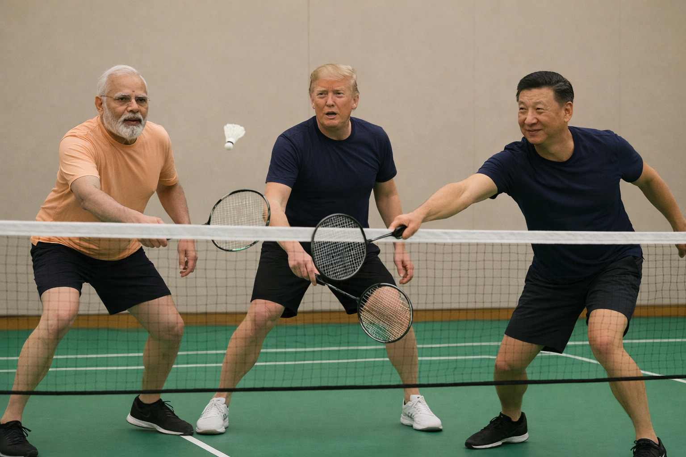

# A2A Badminton Scheduling Project

<div align="center">
  
</div>


A multi-agent system demonstrating Agent-to-Agent (A2A) communication using Google's A2A SDK. The project simulates a real-world scenario where multiple AI agents coordinate to schedule badminton games.


## 🎯 Project Goal

This project demonstrates **Agent-to-Agent (A2A) communication** where AI agents can:
- Communicate with each other autonomously
- Coordinate tasks across multiple agents
- Share information and make collaborative decisions
- Use tools to check availability and book resources

### Real-World Scenario

**Trump Agent** (Host/Coordinator) wants to organize a badminton game. It needs to:
1. Ask **Jingping Agent** and **Modi Agent** about their availability
2. Find a common time slot when both are free
3. Check court availability using tools
4. Book a badminton court for the agreed time

This mimics how human assistants would coordinate - each agent has its own information (calendars, tools) and they communicate to reach a common goal.

---

## 🏗️ Architecture

### Agent Overview

| Agent | Framework | Role | Port | Tools |
|-------|-----------|------|------|-------|
| **Trump Agent** | Google ADK | Host/Coordinator - Orchestrates scheduling | 8000 (ADK Web UI) | `send_message`, `book_badminton_court`, `list_court_availabilities` |
| **Jingping Agent** | LangChain + LangGraph | Jingping's Scheduling Assistant | 10004 | `get_availability` (checks Jingping's calendar) |
| **Modi Agent** | CrewAI | Modi's Scheduling Assistant | 10005 | `AvailabilityTool` (checks Modi's calendar) |

### Technology Stack

- **A2A SDK**: Agent-to-Agent communication protocol
- **Google ADK**: Agent Development Kit for building conversational agents
- **LangChain/LangGraph**: Framework for building LLM applications with memory
- **CrewAI**: Multi-agent orchestration framework
- **Google Gemini**: LLM for agent reasoning
- **UV**: Fast Python package manager

---

## 📋 Prerequisites

- Python 3.11+
- UV package manager 
- Google API Key (for Gemini models)

---


---

## 🔧 How It Works

### 1. Agent Communication Flow

```
User → Trump Agent (ADK)
         ↓
    [Send Message via A2A]
         ↓
    ┌────┴────┐
    ↓         ↓
Modi Agent  Jingping Agent
    ↓         ↓
[Check Calendar]
    ↓         ↓
[Return Availability]
    ↓         ↓
    └────┬────┘
         ↓
    Trump Agent
         ↓
[Find Common Time]
         ↓
[Check Court Availability]
         ↓
[Book Court]
         ↓
    User ← Response
```

### 2. A2A Protocol

Each agent exposes:
- **Agent Card** (`.well-known/agent-card.json`): Metadata about the agent
- **Message Endpoint**: Accepts A2A-formatted messages
- **Response Format**: Returns structured responses

### 3. Tools & Capabilities

**Jingping Agent Tools:**
- `get_availability(date)`: Checks Jingping's calendar for the given date

**Modi Agent Tools:**
- `AvailabilityTool`: Checks Modi's calendar (CrewAI tool format)

**Trump Agent Tools:**
- `send_message(agent_name, task)`: Sends A2A messages to other agents
- `list_court_availabilities(date)`: Lists available court time slots
- `book_badminton_court(date, start_time, end_time, name)`: Books a court

---


---

## 📚 Key Concepts

### Agent-to-Agent (A2A) Communication

- **Decentralized**: Each agent runs independently
- **Protocol-based**: Standard message format for interoperability
- **Asynchronous**: Agents can handle multiple requests concurrently
- **Tool-augmented**: Agents can use tools to access external data

### Why Multiple Frameworks?

This project intentionally uses different frameworks to demonstrate:
- **Interoperability**: A2A works across different agent implementations
- **Framework Comparison**: See how LangChain, CrewAI, and ADK differ
- **Real-world Flexibility**: Organizations may have agents built with different tools

---

## 🎓 Learning Resources

- [Google ADK Documentation](https://ai.google.dev/adk)
- [A2A SDK Documentation](https://github.com/google/a2a-sdk)
- [LangChain Documentation](https://python.langchain.com/)
- [CrewAI Documentation](https://docs.crewai.com/)
- [UV Package Manager](https://docs.astral.sh/uv/)

---


## 🙏 Acknowledgments

- Google AI for ADK and Gemini models
- A2A SDK team for the agent communication protocol
- LangChain and CrewAI communities for excellent frameworks

---

**Happy Agent Building! 🤖🏸**
